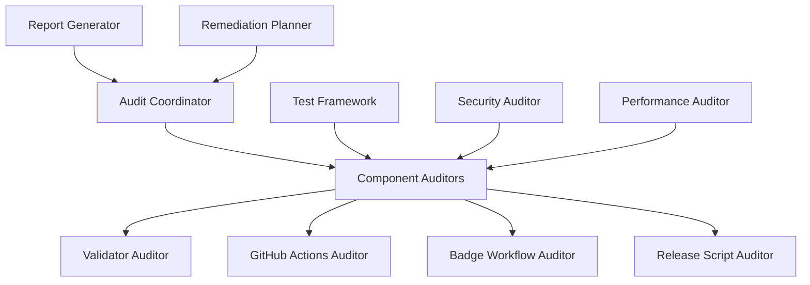
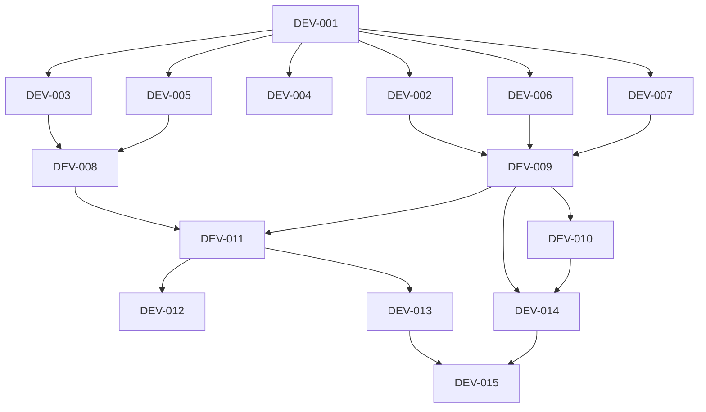
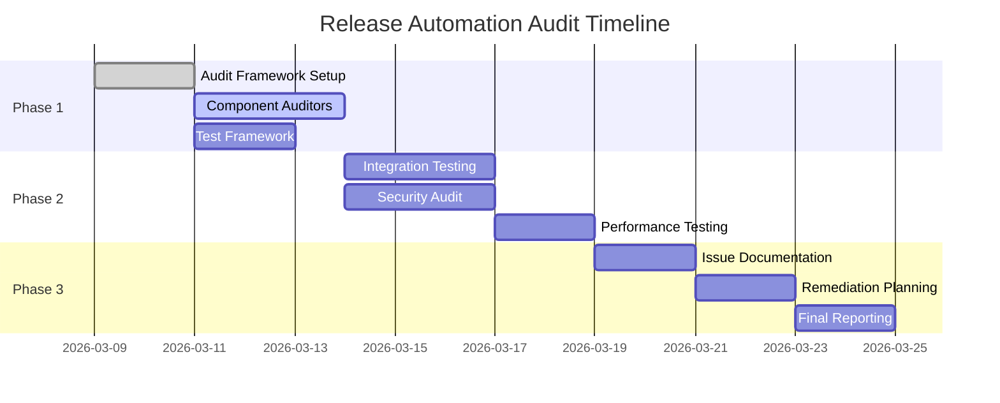

# Implementation Plan: Release Automation Audit

**Status:** In Progress  
**Scope:** audit  
**Priority:** high  
**Created:** 2026-03-09  
**ICW Cycle:** ICW-20260309-171302  
**Specification Reference:** [Release Automation Audit Specification](ICW-20260309-171302-specification.md)  
**Test Design Reference:** [Release Automation Audit Test Design](ICW-20260309-171302-test-design.md)

---

## Executive Summary

Release Automation Audit implementation will systematically audit all release automation components for compatibility with the new task-touch SemVer tagging system. This 3-week phased approach ensures comprehensive coverage while maintaining release process reliability.

---

## Architecture and Design

### System Architecture
**Audit Framework Overview:**

### Component Design
**Key Audit Components:**

#### Component 1: Audit Coordinator
- **Purpose:** Orchestrate overall audit process and coordinate component auditors
- **Responsibilities:**
  - Schedule and coordinate audit activities
  - Aggregate audit results from component auditors
  - Generate comprehensive audit reports
  - Coordinate remediation planning
- **Interfaces:**
  - Input: Audit configuration, component specifications
  - Output: Audit reports, remediation plans
- **Dependencies:** Component auditors, test framework, reporting system

#### Component 2: Component Auditors
- **Purpose:** Specialized auditors for each release automation component
- **Responsibilities:**
  - Execute component-specific compatibility tests
  - Identify issues and vulnerabilities
  - Document findings and recommendations
  - Validate fixes and improvements
- **Interfaces:**
  - Input: Component specifications, test data
  - Output: Component audit results, issue reports
- **Dependencies:** Test framework, component systems

#### Component 3: Test Framework
- **Purpose:** Provide testing infrastructure for audit activities
- **Responsibilities:**
  - Execute unit, integration, and system tests
  - Manage test data and environments
  - Generate test reports and metrics
  - Support automated and manual testing
- **Interfaces:**
  - Input: Test specifications, test data
  - Output: Test results, performance metrics
- **Dependencies:** Test environments, component systems

### Data Model
**Key Audit Data Structures:**

| Entity | Attributes | Relationships |
|--------|------------|--------------|
| AuditSession | sessionId, startTime, endTime, status | hasMany ComponentAudits |
| ComponentAudit | componentId, findings, issues, recommendations | belongsTo AuditSession |
| TestResult | testId, status, duration, metrics | belongsTo ComponentAudit |
| Issue | issueId, severity, description, remediation | belongsTo ComponentAudit |
| RemediationPlan | planId, tasks, timeline, resources | hasMany Issues |

### Technology Stack
**Technologies for Audit Implementation:**

| Layer | Technology | Version | Rationale |
|-------|------------|---------|-----------|
| Audit Framework | Python | 3.9+ | Rich ecosystem, test frameworks |
| Test Automation | pytest | 7.0+ | Comprehensive testing capabilities |
| Reporting | Jinja2 | 3.0+ | Template-based report generation |
| Security | Bandit | 1.7+ | Security vulnerability scanning |
| Performance | pytest-benchmark | 4.0+ | Performance testing and benchmarking |

---

## Development Tasks

### Phase 1: Foundation and Component Analysis (Week 1)
**Core infrastructure and initial component auditing**

| Task ID | Task Description | Priority | Estimated Hours | Dependencies | Assignee |
|--------|-----------------|----------|-----------------|--------------|----------|
| DEV-001 | Setup audit framework infrastructure | High | 16 | | |
| DEV-002 | Create audit coordinator | High | 24 | DEV-001 | |
| DEV-003 | Implement validator auditor | High | 20 | DEV-001 | |
| DEV-004 | Create test framework setup | High | 12 | DEV-001 | |
| DEV-005 | Implement GitHub Actions auditor | High | 20 | DEV-001 | |

### Phase 2: Integration Testing and Security Audit (Week 2)
**Integration testing and security/comprehensive validation**

| Task ID | Task Description | Priority | Estimated Hours | Dependencies | Assignee |
|--------|-----------------|----------|-----------------|--------------|----------|
| DEV-006 | Implement badge workflow auditor | Medium | 16 | DEV-001 | |
| DEV-007 | Create release script auditor | High | 20 | DEV-001 | |
| DEV-008 | Implement security auditor | High | 24 | DEV-003, DEV-005 | |
| DEV-009 | Create integration test suite | High | 32 | DEV-002, DEV-006, DEV-007 | |
| DEV-010 | Implement performance auditor | Medium | 16 | DEV-009 | |

### Phase 3: Remediation Planning and Final Reporting (Week 3)
**Issue documentation, remediation planning, and final reporting**

| Task ID | Task Description | Priority | Estimated Hours | Dependencies | Assignee |
|--------|-----------------|----------|-----------------|--------------|----------|
| DEV-011 | Create issue catalog system | High | 20 | DEV-008, DEV-009 | |
| DEV-012 | Implement remediation planner | High | 24 | DEV-011 | |
| DEV-013 | Create report generation system | High | 20 | DEV-011 | |
| DEV-014 | Execute end-to-end audit validation | High | 32 | DEV-009, DEV-010 | |
| DEV-015 | Generate final audit report | High | 16 | DEV-013, DEV-014 | |

---

## Task Dependencies

### Dependency Graph
**Visual representation of task dependencies:**

### Critical Path Analysis
**Tasks that determine project duration:**

**Critical Path:** DEV-001 → DEV-003 → DEV-008 → DEV-011 → DEV-012
**Critical Path Duration:** 108 hours

**Parallel Execution Opportunities:**
- Component auditors (DEV-003, DEV-005, DEV-006, DEV-007) can run in parallel
- Security and performance auditors can run in parallel
- Report generation and validation can overlap

---

## Resource Requirements

### Human Resources
**Team Composition and Roles:**

| Role | Person | Allocation | Responsibilities |
|------|--------|------------|------------------|
| Audit Lead | Release Engineer | 100% | Overall audit coordination and reporting |
| Security Specialist | Security Engineer | 75% | Security auditing and vulnerability assessment |
| DevOps Engineer | DevOps Team | 75% | Infrastructure and automation auditing |
| QA Engineer | QA Team | 100% | Test framework development and execution |
| Performance Engineer | Performance Team | 50% | Performance testing and benchmarking |

### Technical Resources
**Tools, Environments, and Infrastructure:**

| Resource | Specification | Quantity | Purpose |
|----------|----------------|----------|---------|
| Test Repository | Clean test repo with task-touch enabled | 1 | Audit testing environment |
| GitHub Actions Test | Isolated CI/CD test environment | 1 | Workflow testing |
| Security Tools | Bandit, safety, semgrep | Multiple | Security scanning |
| Performance Tools | pytest-benchmark, locust | Multiple | Performance testing |
| Reporting Tools | Jinja2, matplotlib, pandas | Multiple | Report generation |

### External Dependencies
**Third-party Services and APIs:**

| Dependency | Provider | Criticality | Contingency Plan |
|------------|----------|------------|-----------------|
| GitHub API | GitHub | High | Rate limiting, token management |
| Security Scanning | Multiple tools | Medium | Alternative scanning tools |
| Performance Monitoring | Cloud services | Low | Local performance testing |

---

## Timeline and Milestones

### Project Timeline
**Overall Project Schedule:**

### Key Milestones
**Major Project Checkpoints:**

| Milestone | Date | Deliverables | Success Criteria |
|-----------|------|--------------|------------------|
| M1: Foundation Complete | Week 1 | Audit framework, component auditors | All auditors functional and tested |
| M2: Integration Testing Complete | Week 2 | Integration tests, security audit | All integration tests pass |
| M3: Audit Complete | Week 3 | Issue catalog, remediation plans | Comprehensive audit report delivered |

---

## Risk Management

### Risk Assessment Matrix
**Identified Risks and Their Impact:**

| Risk | Probability | Impact | Risk Level | Mitigation Strategy |
|------|-------------|--------|------------|-------------------|
| Component compatibility issues | High | High | High | Comprehensive testing, fallback plans |
| Security vulnerabilities discovered | Medium | High | High | Security review, immediate remediation |
| Performance regressions | Medium | Medium | Medium | Performance benchmarking, optimization |
| Resource constraints | High | Medium | Medium | Prioritization, parallel execution |
| Integration failures | Medium | High | Medium | End-to-end testing, rollback plans |

### Risk Monitoring
**How Risks Will Be Tracked and Managed:**

- **Daily Risk Reviews:** Assess current risk status and mitigation progress
- **Risk Register:** Maintain detailed risk information and mitigation status
- **Mitigation Tracking:** Monitor effectiveness of implemented mitigation strategies
- **Escalation Process:** Clear escalation path for high-impact risks

---

## Quality Assurance

### Code Quality Standards
**Standards for Audit Code Quality:**

| Standard | Target | Measurement Tool |
|----------|--------|------------------|
| Code Coverage | ≥ 85% | pytest-cov |
| Code Complexity | < 10 | McCabe complexity |
| Code Duplication | < 3% | SonarQube |
| Security Issues | 0 critical | Bandit, safety |

### Review Process
**Code Review and Quality Checks:**

1. **Peer Review:** All audit code requires peer review
2. **Security Review:** Security-focused review for audit tools
3. **Performance Review:** Performance impact assessment for audit code
4. **Documentation Review:** Complete documentation for all audit components

---

## Deployment Strategy

### Audit Execution Plan
**How the Audit Will Be Conducted:**

| Environment | Deployment Method | Frequency | Approval Required |
|-------------|-------------------|-----------|------------------|
| Development | Local execution | As needed | None |
| Test | Automated execution | Daily | QA Lead |
| Staging | Manual execution | Weekly | Audit Lead |
| Production | Read-only monitoring | Continuous | All stakeholders |

### Rollback Strategy
**How to Handle Audit Issues:**

- **Audit Rollback:** Ability to revert audit changes if needed
- **Issue Reversal:** Clear process for reversing audit findings
- **Configuration Rollback:** Versioned audit configurations
- **Data Recovery:** Backup and recovery for audit data

---

## Monitoring and Maintenance

### Monitoring Requirements
**What Needs to Be Monitored During Audit:**

| Metric | Target | Alert Threshold |
|--------|--------|-----------------|
| Audit Progress | 100% completion | < 90% on schedule |
| Test Coverage | ≥ 85% | < 80% |
| Security Issues | 0 critical | Any critical issues |
| Performance Impact | < 5% regression | > 5% regression |
| Resource Usage | < 80% | > 85% |

### Maintenance Plan
**Ongoing Maintenance Activities:**

- **Daily:** Audit progress monitoring and issue tracking
- **Weekly:** Security scan updates and performance benchmarking
- **Monthly:** Audit tool updates and documentation maintenance
- **Quarterly:** Comprehensive audit framework review

---

## Communication Plan

### Stakeholder Communication
**How and When Stakeholders Will Be Informed:**

| Audience | Frequency | Method | Content |
|----------|-----------|--------|---------|
| Audit Team | Daily | Stand-up | Progress, blockers, issues |
| Management | Weekly | Email report | Status, risks, timeline |
| Security Team | As needed | Security brief | Vulnerability findings |
| DevOps Team | Weekly | Technical meeting | Infrastructure issues |

### Reporting
**Regular Project Reports:**

- **Daily Status:** Audit progress, test results, issues found
- **Weekly Report:** Comprehensive audit status, risk assessment, next steps
- **Monthly Review:** Executive summary, budget variance, resource allocation
- **Final Report:** Complete audit findings, remediation recommendations, success metrics

---

## Success Metrics

### Key Performance Indicators
**How Success Will Be Measured:**

| KPI | Target | Measurement Method |
|-----|--------|-------------------|
| Audit Coverage | 100% | Component coverage matrix |
| Issue Detection | ≥ 95% | Issue detection rate |
| Security Compliance | 100% | Security scan results |
| Performance Impact | < 5% | Performance benchmarking |
| Stakeholder Satisfaction | ≥ 4.5/5 | Stakeholder surveys |

---

## Quality Gates

### Before Audit Execution
**Must Be Completed Before Starting Audit:**

- [ ] Audit framework fully implemented and tested
- [ ] All component auditors developed and validated
- [ ] Test environments provisioned and configured
- [ ] Security tools configured and calibrated
- [ ] Performance benchmarks established

### During Audit Execution
**Ongoing Quality Checks:**

- [ ] Daily audit progress reviews completed
- [ ] Security scans passed with no critical issues
- [ ] Performance benchmarks met or exceeded
- [ ] Issue documentation complete and accurate
- [ ] Stakeholder communications current

### Before Audit Completion
**Final Quality Requirements:**

- [ ] All audit components executed successfully
- [ ] All identified issues documented and prioritized
- [ ] Remediation plans created for all critical issues
- [ ] Final audit report comprehensive and accurate
- [ ] Stakeholder sign-off received

---

## Conclusion

### Implementation Readiness
This implementation plan provides a comprehensive approach to auditing the release automation system for task-touch SemVer compatibility. The phased approach ensures thorough coverage while maintaining project timelines and quality standards.

### Next Steps
1. **Immediate:** Set up audit framework infrastructure
2. **Week 1:** Implement component auditors and begin initial testing
3. **Week 2:** Execute comprehensive integration and security testing
4. **Week 3:** Complete issue documentation and remediation planning
5. **Final:** Deliver comprehensive audit report and recommendations

---

**Last Updated:** 2026-03-09  
**Implementation Start:** 2026-03-09  
**Target Completion:** 2026-03-29  
**ICW Progress:** Phase 3 of 3 Complete
