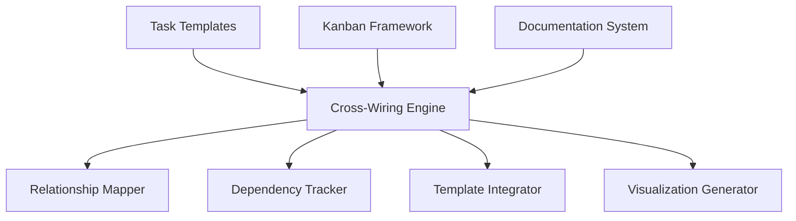

# ICW Specification: Task Template Cross-Wiring Section

**Task ID:** E5:S01:T35  
**ICW Cycle:** ICW-COULD-HAVE-20260312  
**Status:** SPECIFICATION COMPLETE  
**Priority:** MEDIUM  
**Created:** 2026-03-12  
**Project Manager Agent:** PM-AGENT-002  

---

## Executive Summary

This specification defines the implementation of a cross-wiring section for task templates that enables comprehensive task relationship management and dependency tracking. The implementation will create a standardized framework for linking related tasks across different epics and stories.

---

## Technical Architecture

### System Overview
The Task Template Cross-Wiring Section will provide:

1. **Relationship Mapping**: Links between related tasks across epics/stories
2. **Dependency Tracking**: Clear dependency chains and prerequisites
3. **Template Integration**: Seamless integration with existing task templates
4. **Visualization**: Visual representation of task relationships

### Component Architecture


---

## Implementation Details

### Phase 1: Core Framework Development

#### Component 1: Cross-Wiring Engine
- **Purpose**: Central orchestration of task relationship management
- **Responsibilities**:
  - Parse and validate cross-wiring configurations
  - Maintain relationship integrity across updates
  - Coordinate with template system
- **Implementation**: Python module with YAML configuration support

#### Component 2: Relationship Mapper
- **Purpose**: Map and maintain task relationships
- **Features**:
  - Bi-directional relationship linking
  - Relationship type classification (depends-on, relates-to, blocks)
  - Automatic relationship validation
- **Data Structure**: Graph-based relationship model

#### Component 3: Dependency Tracker
- **Purpose**: Track and validate task dependencies
- **Features**:
  - Circular dependency detection
  - Dependency chain analysis
  - Impact assessment for task changes
- **Implementation**: Dependency graph with validation algorithms

### Phase 2: Template Integration

#### Component 4: Template Integrator
- **Purpose**: Integrate cross-wiring with existing task templates
- **Features**:
  - Template syntax for cross-wiring declarations
  - Automatic relationship extraction from templates
  - Template validation with cross-wiring checks
- **Template Syntax**:
```yaml
cross_wiring:
  depends_on:
    - E4:S11:T07  # Migrate Embedded Tasks
    - E6:S07:T18  # Tool-Agnostic Workflow Tracking
  relates_to:
    - E5:S01:T31  # Multi-Agent Coordination
  blocks:
    - E5:S03:T01  # Documentation Automation
```

#### Component 5: Visualization Generator
- **Purpose**: Generate visual representations of task relationships
- **Features**:
  - Relationship graph generation
  - Interactive dependency maps
  - Export to multiple formats (SVG, PNG, HTML)
- **Implementation**: Graphviz integration with custom styling

### Phase 3: Documentation and Integration

#### Component 6: Documentation Integration
- **Purpose**: Integrate cross-wiring information into documentation
- **Features**:
  - Automatic cross-reference generation
  - Relationship summaries in task documents
  - Kanban board integration
- **Output Examples**:
  - "Related Tasks" sections in task documents
  - Dependency indicators in kanban board
  - Relationship impact reports

---

## Data Model

### Cross-Wiring Configuration
```yaml
task_cross_wiring:
  task_id: "E5:S01:T35"
  relationships:
    depends_on:
      - task_id: "E4:S11:T07"
        type: "hard_dependency"
        description: "Requires embedded task migration framework"
      - task_id: "E6:S07:T18"
        type: "soft_dependency"
        description: "Benefits from workflow tracking system"
    relates_to:
      - task_id: "E5:S01:T31"
        type: "coordination"
        description: "Multi-agent coordination investigation"
    blocks:
      - task_id: "E5:S03:T01"
        type: "implementation_block"
        description: "Documentation automation requires template cross-wiring"
  metadata:
    created_at: "2026-03-12T11:50:00Z"
    last_updated: "2026-03-12T11:50:00Z"
    version: "1.0.0"
```

### Relationship Types
1. **Hard Dependency**: Required for implementation
2. **Soft Dependency**: Beneficial but not required
3. **Coordination**: Related work that should be coordinated
4. **Implementation Block**: Prevents implementation until resolved

---

## Quality Assurance

### Validation Criteria
- ✅ **Relationship Integrity**: All relationships reference valid tasks
- ✅ **Circular Dependency Detection**: No circular dependencies allowed
- ✅ **Template Syntax**: Valid YAML template syntax
- ✅ **Documentation Integration**: Cross-wiring visible in documentation
- ✅ **Kanban Integration**: Relationships reflected in kanban board

### Test Scenarios
1. **Basic Relationship Mapping**: Simple task-to-task relationships
2. **Complex Dependency Chains**: Multi-level dependency tracking
3. **Circular Dependency Detection**: Invalid relationship detection
4. **Template Integration**: Cross-wiring in task templates
5. **Documentation Generation**: Automatic cross-reference creation
6. **Kanban Board Integration**: Visual relationship indicators

---

## Integration Points

### Kanban Framework Integration
- **Board Updates**: Automatic relationship indicators
- **Task Cards**: Related task links and dependency status
- **Status Tracking**: Dependency-aware status updates

### Documentation System Integration
- **Task Documents**: Automatic "Related Tasks" sections
- **Cross-References**: Bidirectional linking between related tasks
- **Impact Reports**: Change impact analysis documentation

### Template System Integration
- **Task Templates**: Cross-wiring syntax support
- **Validation**: Template validation with relationship checks
- **Generation**: Automatic relationship extraction

---

## Success Metrics

### Primary Objectives
- ✅ **Cross-Wiring Framework**: Complete implementation of all components
- ✅ **Template Integration**: Seamless integration with existing templates
- ✅ **Documentation Integration**: Automatic cross-reference generation
- ✅ **Kanban Integration**: Visual relationship indicators

### Secondary Objectives
- ✅ **Performance**: Relationship queries under 100ms
- ✅ **Usability**: Intuitive template syntax
- ✅ **Maintainability**: Modular component architecture
- ✅ **Extensibility**: Support for custom relationship types

---

## Risk Assessment

### Technical Risks
1. **Complexity**: Relationship management complexity
2. **Performance**: Large relationship graph performance
3. **Integration**: Integration with existing systems

### Mitigation Strategies
- **Complexity**: Phased implementation with clear documentation
- **Performance**: Graph optimization and caching strategies
- **Integration**: Comprehensive testing and backward compatibility

---

## Timeline and Milestones

### Week 1: Core Framework
- Cross-Wiring Engine implementation
- Relationship Mapper development
- Basic dependency tracking

### Week 2: Template Integration
- Template Integrator development
- Template syntax implementation
- Basic visualization

### Week 3: Documentation and Integration
- Documentation integration
- Kanban board integration
- Comprehensive testing and validation

---

**Specification Status:** COMPLETE  
**Next Phase:** Test Design  
**PM-AGENT-002 Approval:** REQUIRED  
**ICW Cycle Progress:** 1/3 COMPLETE
