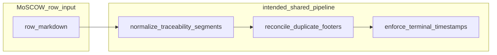

# E2:S15:T04 - Planning: Spec, Tests, Implementation Plan (IPP)

**Host Task:** [`T04-investigate-earliest-last-modified-timestamp-overwrite-regression-br069.md`](../project-management/kanban/epics/Epic-2/Story-015-ipw-governance-and-publication-contract/T04-investigate-earliest-last-modified-timestamp-overwrite-regression-br069.md) **(E2:S15:T04)**  
**Planning for:** [BR-069 - kboard/fbuboard earliest `Last modified` timestamps overwritten / task-ID multiplication](../project-management/kanban/fr-br/BR-069-kboard-fbuboard-earliest-last-modified-timestamps-overwritten.md)  
**Status:** Published

---

## 1. Specification

### 1.1 Goal

Isolate why MoSCOW rows on `kboard.md` and `fbuboard.md` still exhibit **forensic timestamp churn** and **traceability segment multiplication** after FR-089 / E2:S15:T03 guardrails. Deliver a concrete **root-cause narrative**, **ordering invariants**, and **implementation-ready guardrails** so touch-only and reconciliation flows cannot shift preserved historical evidence or append duplicate FBU/task segments.

### 1.2 Functional requirements

- **F1:** Treat **exactly one** terminal `| Last modified: YYYY-MM-DD HH:MM UTC` segment per MoSCOW row as the forensic anchor after normalization (aligned with FR-089 single-footer grammar where applicable).
- **F2:** `_normalize_traceability_segments_for_row` MUST NOT leave legacy `Last modified` segments **non-terminal** when appending `| FBU | Task | IPP` tails, or MUST strip/reposition footers before rebuild so enforcement does not mis-detect “missing” timestamps.
- **F3:** `enforce_moscow_row_timestamps` MUST NOT append a synthetic “now” timestamp when any valid `Last modified` chunk already exists on the row (not only when it is syntactically terminal).
- **F4:** **Pipeline order** between `update_kanban_board` and `enforce_terminal_timestamps_on_boards` MUST converge to the same canonical semantics for identical inputs, or one path MUST be deprecated in favor of a single shared transform DAG.
- **F5:** Duplicate-footer reconciliation (`reconcile_duplicate_moscow_row_footers`) remains governed by dual-agreement policy from [IPP-E2S15T03](IPP-E2S15T03-duplicate-footer-validation-hardening-and-timestamp-divergence-guardrails.md); divergence rows remain unchanged by design.
- **F6:** Task-ID link segments MUST NOT duplicate after repeated `normalize_board_traceability_segments` passes (extends FR-089 F8/F9).

### 1.3 Non-functional requirements

- **N1:** Diagnostics remain auditable (`rows_with_duplicate_footers`, `timestamp_order_divergence_row_ids`, optional new counters for “append suppressed” vs “tail rebuilt”).
- **N2:** Regression tests target `packages/frameworks/workflow mgt/scripts/test_update_kanban_docs.py` patterns (pytest).
- **N3:** Behavior is deterministic and idempotent for canonical rows after remediation.

### 1.4 Out of scope

- Rewriting FR/BR/UXR issue doc bodies or MoSCOW prioritization policy.
- Manual cleanup of historical board corruption without a documented machine-assisted repair strategy (may be a separate governance task).

### 1.5 Constraints

- UKW (`enforce_terminal_timestamps_on_boards`) is already documented as **not** a full corpus repair pass ([BR-069](../project-management/kanban/fr-br/BR-069-kboard-fbuboard-earliest-last-modified-timestamps-overwritten.md)); remediation must address **code**, not expectations that UKW alone heals all rows.

---

## 2. Test design

| ID | Area | What to verify |
| ---- | ---- | ---- |
| R1 | Pipeline parity | Same synthetic MoSCOW row produces **byte-identical** output after full `update_kanban_board` ordering vs UKW `enforce_terminal_timestamps_on_boards` ordering **once** remediation lands (or explicit documented delta is retired). |
| R2 | Terminal timestamp preservation | Single-footer row with historical `Last modified` never gains a **second** `Last modified` chunk solely because traceability segments were appended after normalization. |
| R3 | Normalize + enforce interaction | After `_normalize_traceability_segments_for_row`, either the row ends with exactly one footer at EOL, or `enforce_moscow_row_timestamps` does not append `timestamp_now`. |
| R4 | Duplicate-footer collapse | Rows with two chronologically ordered footers where dual-agreement passes collapse to oldest timestamp **without** subsequent duplicate footer introduction by enforcement. |
| R5 | Divergence preservation | Rows flagged `timestamp_order_divergence` stay structurally stable across repeated transforms (no silent “fix” that destroys evidence). |
| R6 | Task-ID idempotency | Repeated application of `normalize_board_traceability_segments` on a clean row does not increase task-link segment count. |
| R7 | fbuboard branch | `_cleanup_fbuboard_active_rows` + reconcile + normalize + enforce ordering does not regress R2–R4 for FBU-token rows. |
| R8 | Traceability | BR-069, E2:S15:T04, Story 015, this IPP, and boards remain bidirectionally linked. |
| R9 | Documentary regression | Test 4.13 fails if ordering divergence or double-footer append regress without intentional contract change (after remediation, rewrite assertions to preservation semantics). |

---

## 3. Implementation plan

### Phase A — Reproduction harness (fixed)

1. Minimal MoSCOW fixture strings in `test_update_kanban_docs.py` (or adjacent helper) covering: single footer, dual footer pass, dual footer divergence, FBU+task+IPP row shape.
2. Call `normalize_board_traceability_segments` → `reconcile_duplicate_moscow_row_footers` → `enforce_moscow_row_timestamps` in **both** orders documented in §5 to lock expected post-remediation parity.

### Phase B — Remediation implementation (follow-on coding task)

1. Refactor `_normalize_traceability_segments_for_row` to **strip all** `Last modified` chunks before rebuilding FBU/Task/IPP tail, then re-attach **preserved** canonical footer (single chosen timestamp per FR-089 policy) at EOL; **or** teach `enforce_moscow_row_timestamps` to detect any footer chunk anywhere in the row.
2. Unify pipeline order: extract a single internal `transform_moscow_row_pipeline(content, project_root, timestamp_now, mode)` used by both `update_kanban_board` and `enforce_terminal_timestamps_on_boards`.
3. Extend duplicate task-link stripping if normalize still duplicates FBU/task tokens on successive runs.

### Phase C — Guardrails and diagnostics

1. Emit explicit metric when enforcement **would** have appended `timestamp_now` but suppression rules fire (post-implementation).
2. Keep divergence + duplicate-footer reporting from T03; add assertion tests that counts do not explode on idempotent re-run for clean rows.

### Phase D — Governance

1. Link IPP from task doc, BR-069, Story 015 checklist.
2. After code merge, update BR-069 acceptance boxes and consider closing criteria for **implementation** vs **investigation**.

---

## 4. Success criteria (investigation + planning)

- [x] IPP filed under `docs/implementation-cycles/IPP-E2S15T04-*.md` with spec, tests, and plan.
- [x] Root cause hypothesis substantiated with code references and reproduction (§5).
- [x] Guardrail requirements F1–F6 and test matrix R1–R8 defined for implementation follow-on.
- [ ] Code changes merged and regression tests passing (tracked outside this IPP closure).
- [ ] BR-069 closed or narrowed after implementation satisfies F1–F6.

---

## 5. Root cause analysis (evidence)

### 5.1 Pipeline order divergence (confirmed)

Two different call orders exist in [`update_kanban_docs.py`](../../packages/frameworks/workflow%20mgt/scripts/update_kanban_docs.py):

| Path | Order |
| --- | --- |
| `update_kanban_board` | `normalize_board_traceability_segments` → `reconcile_duplicate_moscow_row_footers` → `enforce_moscow_row_timestamps` |
| `enforce_terminal_timestamps_on_boards` (kboard / non-fbuboard) | `reconcile_duplicate_moscow_row_footers` → `normalize_board_traceability_segments` → `enforce_moscow_row_timestamps` |
| `enforce_terminal_timestamps_on_boards` (fbuboard) | `_cleanup_fbuboard_active_rows` → `reconcile_duplicate_moscow_row_footers` → `normalize_board_traceability_segments` → `enforce_moscow_row_timestamps` |

Non-commutative transforms imply UKW and RW/board-update paths can yield **different** row text for the same starting row.

### 5.2 Normalize vs enforce interaction (confirmed failure mode)

`_normalize_traceability_segments_for_row` rebuilds rows as:

`return f"{line.rstrip()} | {fbu_token} | {task_token} | {ipp_token}"`

It strips prior IPP/no-IPP segments but **does not remove existing `Last modified` chunks** before appending traceability tokens. Therefore a row whose **last** semantic footer was terminal `Last modified` can end up with structure:

`… | Last modified: <historical> | [FBU] | [Task] | —No IPP—`

The terminal `enforce_moscow_row_timestamps` regex requires a footer **at end of line**:

```python
ts_pattern = re.compile(r"\|\sLast modified:\s\d{4}-\d{2}-\d{2}\s\d{2}:\d{2}\sUTC\s*$")
```

If no match, enforcement **appends** `| Last modified: <timestamp_now>`, introducing a **second** footer or displacing forensic interpretation—matching BR-069 “overwrite” reports and duplicate-footer churn.

### 5.3 Controlled reproduction (library-level)

Using in-repo imports from `packages/frameworks/workflow mgt/scripts/update_kanban_docs.py`, a minimal MoSCOW section with one bold FBU row and a single historical footer shows:

- After **UKW ordering** (reconcile → normalize → enforce), output can append **`timestamp_now`** while retaining the historical chunk earlier in the line—**two** `Last modified` segments.
- After **`update_kanban_board` ordering** (normalize → reconcile → enforce), outputs **differ** from UKW on the same input for duplicate-footer scenarios—demonstrating ordering sensitivity.

**Automated lock:** `test_4_13_br069_pipeline_order_divergence_and_non_terminal_footer_append` in [`test_update_kanban_docs.py`](../../packages/frameworks/workflow%20mgt/scripts/test_update_kanban_docs.py) encodes both behaviors (documentary until remediation lands).

### 5.4 Relationship to FR-089 / T03

[IPP-E2S15T03](IPP-E2S15T03-duplicate-footer-validation-hardening-and-timestamp-divergence-guardrails.md) defines duplicate-footer **detection** and dual-agreement **reconciliation** but does not eliminate the **normalize-then-append-footer** class of bugs above. BR-069 remains valid until normalize and enforcement share a single invariant on footer placement.

---

## 6. Guardrail definitions (for implementation)

- **G1 (timestamp):** Before or during traceability rebuild, collect all `Last modified` chunks; choose preserved value per FR-089 dual-agreement when multiple; emit single terminal footer **after** FBU/Task/IPP segments.
- **G2 (enforce):** If G1 is satisfied, `enforce_moscow_row_timestamps` is a no-op for that row unless no footer exists anywhere.
- **G3 (task-ID):** Before rebuild, deduplicate consecutive identical `[E#:S#:T#](...)` segments (extend existing FR-089 normalization).
- **G4 (pipeline):** One ordered pipeline function; UKW and board update both call it—eliminates order-dependent drift.

---

## 7. Row transform DAG (reference)



---

## References

- [Host task E2:S15:T04](../project-management/kanban/epics/Epic-2/Story-015-ipw-governance-and-publication-contract/T04-investigate-earliest-last-modified-timestamp-overwrite-regression-br069.md)
- [BR-069](../project-management/kanban/fr-br/BR-069-kboard-fbuboard-earliest-last-modified-timestamps-overwritten.md)
- [IPP-E2S15T03 – duplicate footer / divergence guardrails](IPP-E2S15T03-duplicate-footer-validation-hardening-and-timestamp-divergence-guardrails.md)
- [FR-089](../project-management/kanban/fr-br/FR-089-ipw-board-row-footer-duplication-validation-hardening.md)
- [UXR-009](../project-management/kanban/fr-br/UXR-009-last-modified-stamp-forensic-integrity-and-drift-protection.md)
- [Story 015](../project-management/kanban/epics/Epic-2/Story-015-ipw-governance-and-publication-contract.md)
- Tests: [`packages/frameworks/workflow mgt/scripts/test_update_kanban_docs.py`](../../packages/frameworks/workflow%20mgt/scripts/test_update_kanban_docs.py)
