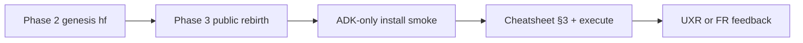

# E6:S09:T06 — Planning: ECC harness phases 2–5 (FR-098)

**Host Task:** [`T06-ecc-harness-phases-2-5-fr098.md`](../project-management/kanban/epics/Epic-6/Story-009-ai-dev-kit-installation-and-adopter-integration/T06-ecc-harness-phases-2-5-fr098.md) **(E6:S09:T06)**  
**Planning for:** [FR-098 — Optional ECC harness layer integration](../project-management/kanban/fr-br/FR-098-ecc-optional-harness-layer-integration.md)  
**Status:** Phases 2–5 **delivered** — host task **COMPLETE** (**v0.6.9.6+3**); FR-098 **IMPLEMENTED**. **Wave E** (public-repo ECC validation) **planned** — blocked on [FR-099](../project-management/kanban/fr-br/FR-099-spin-off-book-epic-to-private-repository.md) Phase 3.

> **IPW (Implementation Planning Workflow):** Produced 2026-05-26 per `.claude/commands/ipw.md`. Host task was **E6:S09:T05** invocation; T05 is **COMPLETE** (Phase 1); this package anchors **phases 2–5** on **E6:S09:T06**.  
> **Releases (T06):** **v0.6.9.6+2** — Waves A–D (`RW --art`); **v0.6.9.6+3** — maintainer dogfood T8 dry-run (`RW --art`); **v0.6.9.6+0** — IPP §7 closure (`RW -d --doc-policy-zero`); **v0.6.9.6+4** — cheatsheet §3 throwaway E2E playbook (`RW -d --art`).

---

## 1. Requirements (Ascertained Baseline)

### 1.1 Functional requirements (ascertained)

| ID | Requirement | Source (FR/BR/Task) |
| -- | ----------- | ------------------- |
| RF1 | Optional ECC install step in **greenfield** path (FR-080) and **brownfield** guidance (FR-081); clearly non-blocking for ADK-only adopters | FR-098-F5, T06 AC Phase 2 |
| RF2 | Bridge workflow: copy [`ecc-adk-bridge.yaml.template`](../../packages/frameworks/workflow%20mgt/config/ecc-adk-bridge.yaml.template) → project-root `ecc-adk-bridge.yaml`; pin `ecc_version_pin`; document `minimal` vs `core` profile naming | FR-098-F3, spec §7–§8 |
| RF3 | Validate bridge fields including `adk_skill_pack_path` alignment with T05 skill pack | T05 validator, RF2 |
| RF4 | Hook defaults: `hook_profile: minimal`, hooks-off install discipline; populate `disabled_hooks` from Phase 0 conflict-resolve (RW/git) | spec §8, Phase 0 eval |
| RF5 | Document SessionStart context hook and **advisory** pre-RW quality gate (ECC hooks do not replace ADK validators) | Roadmap phase 3, T06 |
| RF6 | Optional AgentShield documented as RW Step 9 **add-on**; failures non-blocking; ADK Step 9 scripts remain authoritative | spec §4, T06 AC Phase 4 |
| RF7 | **FR-098-F6:** Layered architecture (ADK project OS; ECC harness OS) in user-docs + cheatsheet cross-links | FR-098-F6 |
| RF8 | Phase 5 book/public positioning sidebar (Head First AI-Assisted Development) linked from cheatsheet | FR-098 phased table |
| RF9 | Deterministic validators + pytest for bridge YAML and install manifest (extend or sibling to `validate_adk_ecc_skill_pack.py`) | T05 pattern, RF3 |
| RF10 | **Real-world validation** on public ADK repo after [FR-099](../project-management/kanban/fr-br/FR-099-spin-off-book-epic-to-private-repository.md) Phase 3: greenfield install, then cheatsheet §3 (including optional `--execute`) | Wave E, maintainer plan 2026-05-26 |
| RF11 | Capture **usage evidence + feedback** (UXR and/or FR) from public-repo pass; link to **E1:S04:T03** Phase 4 and/or follow-on E6 task | Wave E |
| RF12 | Prove **ADK-only** path on public tree (FR-099-F6) **before** ECC overlay; ECC remains optional afterward | FR-099-NF2, RNF1 |

### 1.2 Non-functional requirements (ascertained)

| ID | Requirement | Source |
| -- | ----------- | ------ |
| RNF1 | Integration remains **optional**; zero-ECC ADK regression documented | FR-098-NF1 |
| RNF2 | **PATCH-only** SemVer per FR-098 phase under `task_touch`; no MINOR for ECC phases alone | FR-098-NF5, spec §9 |
| RNF3 | Single ECC install path (`single_install_path: true`); no plugin + full installer stacking | spec §8 |
| RNF4 | No duplicate RW/UKW/IPW triggers from default ECC minimal install | FR-098 AC5 |
| RNF5 | Upstream ECC obtained by adopters under MIT license; no vendoring ECC in-tree | spec §1 |
| RNF6 | Public validation repo must be **framework-only** genesis (no Epic 24 / book paths); private [`hf-ai-dev-kit`](https://github.com/RMS-Ltd/hf-ai-dev-kit) is not the execute testbed | FR-099, ADR-006 |

### 1.3 Invariants and boundaries

- **Invariants:** ADK owns RW/UKW/IPW/git/version/Kanban; ECC defers per `conflict_rules` in bridge template; T05 `adk-*` skills remain authoritative workflow surface.
- **In scope:** Phases 2–5 per [integration spec §10](../../docs/architecture/standards-and-adrs/ecc-adk-harness-layer-integration-specification.md); ordered waves in one task (**T06**).
- **Out of scope:** Re-shipping Phase 1 skills; ECC Pro; mandatory ECC; replacing blocking RW Step 9 validators; live `npx ecc-install` in CI without opt-in gate; **full ECC overlay on canonical `RMS-Ltd/hf-ai-dev-kit` `dev`** (framework source — dry-run only there).
- **Post-delivery (Wave E):** Real **`ecc-install --execute`** and adopter feedback on **new public** `earlution/ai-dev-kit` after FR-099 genesis — see §8.

---

## 2. Specification

### 2.1 Goal

Enable adopters to **optionally** install ECC alongside ADK with a validated bridge file, safe hook defaults, documented AgentShield add-on, and clear layered-architecture positioning—without weakening ADK governance or FR-080/FR-081 closure criteria.

### 2.2 Specification mapping from ascertained requirements

| Wave | Maps to | Primary artifacts |
| ---- | ------- | ----------------- |
| **Wave A (Phase 2)** | RF1–RF3, RF9 | Install doc section; `install_ecc_harness_optional.sh` or equivalent procedure doc; `validate_ecc_adk_bridge.py` + pytest |
| **Wave B (Phase 3)** | RF4–RF5 | Bridge template `disabled_hooks` examples; cheatsheet § hooks; spec §8 update |
| **Wave C (Phase 4)** | RF6, RNF4 | `docs/.../ecc-agentshield-rw-step9-bridge.md` (or KB subsection); RW agent guide add-on note |
| **Wave D (Phase 5)** | RF7–RF8 | Cheatsheet architecture section; FR-098-F6 closure; book sidebar stub |
| **Wave E (post-delivery)** | RF10–RF12 | Public reborn repo: greenfield ADK + optional ECC execute + FR/UXR feedback | §8 |

### 2.3 Constraints

- Installer step must not block [T01 FR-080](../project-management/kanban/epics/Epic-6/Story-009-ai-dev-kit-installation-and-adopter-integration/T01-greenfield-installation-process-fr080.md) acceptance.
- Brownfield path references [ADR-003](docs/architecture/standards-and-adrs/ADR-003-greenfield-vs-brownfield-adoption.md) optional surfaces only.
- kboard MoSCOW rows must avoid bare `COMPLETE` token in row text (UKW prune); use “Phase 1 shipped” wording for T05 references.
- ECC profile pin must match documented package (`minimal` on GitHub rc vs `core` on npm 1.10.0 — spec §8).

### 2.4 Status transition intent (mandatory for IPW-derived implementation tasks)

- **Current task status:** `COMPLETE` (**v0.6.9.6+3**)
- **Transition trigger to IN PROGRESS:** First non-planning implementation change (Wave A file creation or script) — done at **v0.6.9.6+2**.
- **Transition trigger to COMPLETE:** All T06 acceptance criteria satisfied with validator/pytest PASS and dogfood checklist recorded — done at **v0.6.9.6+3**.
- **Atomic propagation requirement:** Task doc status and kboard/fbuboard row for **E6:S09:T06** update in same RW Step 7 session — done (T06/FR-098 archived from Must Have).
- **Owner:** Implementation execution (not this IPW session).

### 2.5 ADR necessity decision (mandatory — IPW Phase 5.0)

Criteria: [`ipw-adr-necessity-checklist.md`](docs/architecture/standards-and-adrs/ipw-adr-necessity-checklist.md) (FR-100).

| ID | Trigger | Y/N | Evidence |
| -- | ------- | --- | -------- |
| T1 | Alternatives | Y | Installer: script vs doc-only vs brownfield-only deferral |
| T2 | Reversibility | Y | Adopter bridge + hooks state not trivially one-revert for all hosts |
| T3 | Blast radius | Y | Install docs, validators, hooks, optional RW Step 9 surface |
| T4 | Precedent | Y | Canonical ECC+ADK adoption path for Story 9 |
| T5 | Constraint trade-off | Y | AgentShield security vs RW validator authority; hook operability vs git policy |
| T6 | Governance contract | Y | Pre-RW hook and Step 9 add-on touch RW boundary |
| T7 | Supersedes | N | Extends existing integration spec; no ADR contradiction |

**Outcome:** `REQUIRED` — **UPDATE** existing normative docs (no new ADR): [integration spec](docs/architecture/standards-and-adrs/ecc-adk-harness-layer-integration-specification.md) §10–§11; light **UPDATE** [ADR-003](docs/architecture/standards-and-adrs/ADR-003-greenfield-vs-brownfield-adoption.md) optional ECC surface note.

Exemption block not used (T1–T7 not all N).

| ID | Exemption | Pass? | Evidence |
| -- | --------- | ----- | -------- |
| E1 | Single locus | — | Not evaluated (REQUIRED) |
| E2 | No new options | — | Not evaluated |
| E3 | Reversible in one task | — | Not evaluated |
| E4 | Spec elsewhere | — | Not evaluated |
| E5 | Documented NONE | — | Not evaluated |

---

## 3. Test design

| ID | Behavior / layer | Expected check | Maps to |
| -- | ---------------- | -------------- | ------- |
| T1 | Bridge template YAML schema | `validate_ecc_adk_bridge.py` exit 0 on repo template | RF2, RF3 |
| T2 | Invalid bridge (missing `conflict_rules`, bad `adk_skill_pack_path`) | pytest negatives; exit non-zero | RF9 |
| T3 | `adk_skill_pack_path` matches T05 canonical path | Cross-check with `validate_adk_ecc_skill_pack.py` | RF3 |
| T4 | Install procedure dry-run | Fixture repo or `--dry-run` flag; no network in default CI | RF1, RNF3 |
| T5 | Docs link integrity | Cheatsheet links to spec §8 procedure; FR-080 optional step present | RF1, RF7 |
| T6 | Hooks documentation | Bridge `disabled_hooks` includes git-workflow deferral example | RF4 |
| T7 | AgentShield doc | States non-blocking; lists ADK Step 9 scripts as authoritative | RF6 |
| T8 | Dogfood (manual) | Maintainer repo: disposable branch, dry-run + bridge validators (**no `--execute` on `hf-ai-dev-kit` `dev`**) | RNF1 — **done** `throwaway/ecc-dogfood-e6s09t06` |
| T9 | Public-repo dogfood (manual) | Clone **public** `earlution/ai-dev-kit` post–Phase 3; ADK-only smoke, then ECC §3 playbook with optional `--execute` on feature branch | RF10–RF12 — **pending** |

**`--skip-tests`:** Not used — installer/bridge/hooks warrant automated validation.

---

## 4. Implementation plan

| Step | Action | Deliverable |
| ---- | ------ | ----------- |
| **1** | **[MANDATORY] Transition E6:S09:T06 `TODO → IN PROGRESS`** in task doc; update `Last updated`. | Task doc status |
| 2 | **Wave A:** Add `validate_ecc_adk_bridge.py` + `test_validate_ecc_adk_bridge.py`; extend or document bridge validation in skills README | Validator PASS |
| 3 | **Wave A:** Add optional ECC install procedure (`packages/frameworks/workflow mgt/scripts/install/install_ecc_harness_optional.sh` or KB guide with equivalent steps) | RF1 script/doc |
| 4 | **Wave A:** UPDATE greenfield install docs + T01 cross-link; FR-098-F5 partial closure | Install docs |
| 5 | **Wave A:** UPDATE cheatsheet §3–5 (installer + bridge copy steps) | Cheatsheet |
| 6 | **Wave B:** Populate bridge template `disabled_hooks` examples; document `hook_profile` / SessionStart / pre-RW advisory | spec §8, RF4–RF5 |
| 7 | **Wave C:** CREATE AgentShield RW Step 9 bridge doc; UPDATE release-workflow agent execution (add-on subsection, non-blocking) | RF6 |
| 8 | **Wave D:** UPDATE cheatsheet + user-docs for FR-098-F6; add book positioning sidebar section | RF7–RF8 |
| 9 | **Wave D:** UPDATE integration spec §10 task anchors to **T06**; UPDATE FR-098 notes | Traceability |
| 10 | RW per wave or at end: `RW E6:S09:T06` with Step 7 four-surface (T06 kboard row replaces T05 phases-2–5 anchor) | Release |
| **11** | **[MANDATORY] Reconcile T06 status** to `COMPLETE` + `✅ COMPLETE (v{version})` when all ACs satisfied; else `IN PROGRESS` / `BLOCKED`. | Task doc + boards — **done** **v0.6.9.6+3** |
| 12 | **Wave E — prerequisite:** [FR-099](../project-management/kanban/fr-br/FR-099-spin-off-book-epic-to-private-repository.md) Phase 3 public rebirth + Phase 4 ADK-only install smoke ([E1:S04:T03](../project-management/kanban/epics/Epic-1/Story-004-repository-branding-and-renaming/T03-spin-off-book-epic-private-repo-fr099.md)) | Public clone ready |
| 13 | **Wave E — execute:** On public clone, run [cheatsheet §3 Throwaway branch playbook](../documentation/user-docs/ecc-adk-integration-cheatsheet.md#throwaway-branch-playbook-end-to-end); allow step 4 `--execute` on feature branch | Real `.cursor/` footprint |
| 14 | **Wave E — feedback:** File UXR/FR with evidence pack (§8.3); optional cheatsheet/install tweaks via `RW -d` | Adopter-grade signal |

### 4.1 Files to create or modify

**CREATE:**

- `packages/frameworks/workflow mgt/scripts/validation/validate_ecc_adk_bridge.py`
- `packages/frameworks/workflow mgt/scripts/validation/test_validate_ecc_adk_bridge.py`
- `packages/frameworks/workflow mgt/scripts/install/install_ecc_harness_optional.sh` (or `KB/.../ecc-optional-install.md` if script deferred)
- `packages/frameworks/workflow mgt/KB/Documentation/Developer_Docs/vwmp/ecc-agentshield-rw-step9-bridge.md`

**UPDATE:**

- `packages/frameworks/workflow mgt/config/ecc-adk-bridge.yaml.template`
- `packages/frameworks/workflow mgt/skills/README.md`
- `../documentation/user-docs/ecc-adk-integration-cheatsheet.md`
- `docs/architecture/standards-and-adrs/ecc-adk-harness-layer-integration-specification.md` (§10–§11)
- `docs/architecture/standards-and-adrs/ADR-003-greenfield-vs-brownfield-adoption.md` (optional ECC note)
- `packages/frameworks/workflow mgt/KB/Documentation/Developer_Docs/vwmp/release-workflow-agent-execution.md` (AgentShield add-on)
- Greenfield install surfaces (T01 doc paths / `INSTALL_IN_YOUR_PROJECT.md` as applicable)
- `docs/project-management/kanban/fr-br/FR-098-ecc-optional-harness-layer-integration.md` (F5/F6 status)
- Task T06, Story 009, Epic 6 (at RW)

**NONE (justified):**

- `packages/frameworks/workflow mgt/skills/adk-*/SKILL.md` — T05 owns Phase 1

### 4.2 Dependency order

1. Wave A validator before install doc claims “validated bridge”
2. Wave A install docs before Wave B hooks (hooks assume bridge exists)
3. Wave C after Wave B (hooks policy stable before AgentShield add-on)
4. Wave D positioning after Waves A–C (accurate feature list)
5. Kanban board T06 row at first implementation RW (not IPW)

### 4.3 Documentation implementation steps

1. Integration spec §10 T06 anchors (Wave D step 9, can draft earlier)
2. Validator + install procedure (Wave A)
3. Cheatsheet installer/bridge/hooks (Waves A–B)
4. AgentShield bridge KB (Wave C)
5. FR-098-F6 + book sidebar (Wave D)

---

## 5. Documentation deliverables

### 5.1 Existing documents to update

| Doc ID | Path | Scope of change | Tied to |
| ------ | ---- | --------------- | ------- |
| D-U1 | `docs/architecture/standards-and-adrs/ecc-adk-harness-layer-integration-specification.md` | §10 task column → T06; §11 hooks/AgentShield pointers | RF4–RF6, ADR REQUIRED |
| D-U2 | `docs/architecture/standards-and-adrs/ADR-003-greenfield-vs-brownfield-adoption.md` | Optional ECC harness surface paragraph | RF1, T1 |
| D-U3 | `../documentation/user-docs/ecc-adk-integration-cheatsheet.md` | Installer, bridge, hooks, AgentShield, architecture | RF1–RF8 |
| D-U4 | `packages/frameworks/workflow mgt/config/ecc-adk-bridge.yaml.template` | `disabled_hooks` examples, comments | RF4 |
| D-U5 | `packages/frameworks/workflow mgt/skills/README.md` | Bridge path + validator commands | RF3 |
| D-U6 | `packages/frameworks/workflow mgt/KB/.../release-workflow-agent-execution.md` | Step 9 AgentShield add-on (non-blocking) | RF6 |
| D-U7 | `docs/project-management/kanban/fr-br/FR-098-*.md` | F5/F6 checkboxes when waves land | RF1, RF7 |
| D-U8 | T01 / install docs | Optional ECC step | RF1 |
| D-U9 | T06, Story 009 task docs | Status, version, AC checkboxes | impl steps 1, 11 |

### 5.2 New documents to create

| Doc ID | Proposed path | Purpose | Tied to |
| ------ | ------------- | ------- | ------- |
| D-C1 | `docs/implementation-cycles/IPP-E6S09T06-ecc-harness-phases-2-5-fr098.md` | This IPP | IPW |
| D-C2 | `packages/frameworks/workflow mgt/scripts/validation/validate_ecc_adk_bridge.py` | Bridge validation | RF9 |
| D-C3 | `packages/frameworks/workflow mgt/scripts/validation/test_validate_ecc_adk_bridge.py` | Regression tests | T2 |
| D-C4 | `packages/frameworks/workflow mgt/scripts/install/install_ecc_harness_optional.sh` | Optional install helper | RF1 |
| D-C5 | `packages/frameworks/workflow mgt/KB/Documentation/Developer_Docs/vwmp/ecc-agentshield-rw-step9-bridge.md` | AgentShield add-on contract | RF6 |

### 5.3 Documentation gaps and explicit non-changes

| Gap / topic | Resolution |
| ----------- | ---------- |
| ECC upstream version drift | Document pins in bridge + evaluation appendix; no in-tree ECC vendor |
| Phase 1 skills | **NONE** — T05 IPP remains historical SoT |
| kboard T06 row | **CREATE at RW** — IPW does not modify boards (plan § Phase 0 intake) |
| New standalone ADR | **NONE** — integration spec + ADR-003 UPDATE per §2.5 REQUIRED |

---

## 6. Documentation housing

| Doc ID | Canonical path | Publication status | Lifecycle | Inbound links to add |
| ------ | -------------- | ------------------ | --------- | -------------------- |
| D-C1 | `docs/implementation-cycles/IPP-E6S09T06-ecc-harness-phases-2-5-fr098.md` | PUBLISHED | evergreen | T06 Input, References |
| D-C2–C3 | `packages/frameworks/workflow mgt/scripts/validation/*ecc_adk_bridge*` | PUBLISHED | evergreen | skills README, IPP §7 |
| D-C4 | `packages/frameworks/workflow mgt/scripts/install/install_ecc_harness_optional.sh` | PUBLISHED | evergreen | cheatsheet, T01 |
| D-C5 | `packages/frameworks/workflow mgt/KB/.../ecc-agentshield-rw-step9-bridge.md` | PUBLISHED | evergreen | release-workflow guide, cheatsheet |
| D-U1 | `docs/architecture/standards-and-adrs/ecc-adk-harness-layer-integration-specification.md` | PUBLISHED | evergreen | FR-098, T06 |
| D-U3 | `../documentation/user-docs/ecc-adk-integration-cheatsheet.md` | PUBLISHED | evergreen | README or install hub |

---

## 7. Success / verification criteria

Verified at **v0.6.9.6+3** (2026-05-26).

- [x] All T06 acceptance criteria in host task doc satisfied
- [x] `validate_ecc_adk_bridge.py` and `validate_adk_ecc_skill_pack.py` both PASS
- [x] pytest modules for bridge (and existing skill pack) green in CI/local
- [x] FR-098-F5 and FR-098-F6 closable with evidence links (FR-098 **IMPLEMENTED**)
- [x] Integration spec §10 lists T06 for phases 2–5
- [x] No ADK-only regression: documented zero-ECC path unchanged
- [x] Dogfood checklist completed on disposable branch `throwaway/ecc-dogfood-e6s09t06` (dry-run only; T8)
- [x] All §5 UPDATE/CREATE items implemented (D-U2 ADR-003 optional ECC note; no §5 deferrals)
- [x] Task ↔ IPP bidirectional links present

### 7.1 Phases 2–5 delivery gate (closed)

All items in §7 above — verified **v0.6.9.6+3** through **v0.6.9.6+4** (docs).

### 7.2 Wave E — public rebirth validation (open)

- [ ] FR-099 Phase 3: public `earlution/ai-dev-kit` exists from book-free genesis
- [ ] FR-099 Phase 4: ADK-only greenfield install + RW/UKW smoke **without** ECC
- [ ] ECC §3 playbook on **public** clone (dry-run reviewed; optional `--execute` on disposable branch)
- [ ] Evidence pack (§8.3) recorded; UXR and/or FR filed
- [ ] Cheatsheet/install updated from findings (if any) via doc-only RW

---

## 8. Post-delivery validation plan (Wave E — FR-099 public rebirth)

**Rationale:** Maintainer dogfood on **`RMS-Ltd/hf-ai-dev-kit`** (T8) validated scripts and docs with **dry-run only** — correct for the framework source repo. The **real adopter test case** is the **new public AI Dev Kit** tree after [FR-099](../project-management/kanban/fr-br/FR-099-spin-off-book-epic-to-private-repository.md) Phase 3 rebirth: framework-only, no book IP, matches FR-080 greenfield intent and FR-098 optional ECC positioning.

### 8.1 Repository roles

| Repo | ECC policy | Purpose |
| ---- | ---------- | ------- |
| **`RMS-Ltd/hf-ai-dev-kit`** (private) | **Dry-run + validators** on throwaway branches; **no** merge of full ECC `.cursor/` overlay into `dev` | Ship frameworks, cheatsheet, validators, skill pack |
| **`earlution/ai-dev-kit`** (public, post–Phase 3) | **Full cheatsheet §3** including optional **`ecc-install --execute`** on a feature branch | Real usage, collisions, hooks/git risk, adopter feedback |

### 8.2 Sequencing (depends on FR-099)

| Step | Owner / anchor | Action |
| ---- | -------------- | ------ |
| 1 | [E1:S04:T03](../project-management/kanban/epics/Epic-1/Story-004-repository-branding-and-renaming/T03-spin-off-book-epic-private-repo-fr099.md) | Complete Phase 2 genesis on private repo if not already merged to public-bound tree |
| 2 | FR-099 Phase 3 | Create **public** `earlution/ai-dev-kit` from genesis (no pre-genesis book objects on public remote) |
| 3 | FR-099 Phase 4 / FR-080 | Clone public repo; greenfield ADK install per [INSTALL_IN_YOUR_PROJECT.md](../../INSTALL_IN_YOUR_PROJECT.md); verify RW, UKW, validators **without** ECC |
| 4 | Wave E (this plan) | Feature branch on **public** clone; run [cheatsheet §3](../documentation/user-docs/ecc-adk-integration-cheatsheet.md#throwaway-branch-playbook-end-to-end) through validators; **optionally** `--execute` after dry-run review |
| 5 | RF11 | File feedback; link from FR-098 notes or new intake task |

**Suggested task home for Wave E execution:** extend **E1:S04:T03** Phase 4 verification checklist **or** new **E6:S09** follow-on task (intake via IPW if implementation/doc RW required).

### 8.3 Evidence pack (minimum)

Record in UXR/FR or task notes:

| Field | Example |
| ----- | ------- |
| Public repo URL + commit/branch | `earlution/ai-dev-kit@…`, `feature/ecc-validation-…` |
| `ecc_version_pin` | npm `ecc-universal@…` tested |
| Dry-run op count | e.g. ~342 on `core` + `--without baseline:hooks` |
| Hooks in plan despite exclusion | Y/N; list `.cursor/hooks/*`, `hooks.json` |
| `common-git-workflow.mdc` (or similar) | Present in plan Y/N |
| `--execute` run | Y/N; summary of `.cursor/` delta |
| ADK smoke after ECC | `IPW` / `RW -d` trivial task still respects RW-only git |
| Verdict | ADK-only OK / ECC optional acceptable / blockers |

### 8.4 Outcomes and doc updates

| Verdict | Action |
| ------- | ------ |
| PASS — acceptable optional path | Note in FR-098 + cheatsheet §10; close Wave E in IPP §7.2 |
| Hooks/git risk | Update bridge `disabled_hooks`, cheatsheet §8; no default `--execute` in INSTALL |
| Cheatsheet gaps | Patch [ecc-adk-integration-cheatsheet.md](../documentation/user-docs/ecc-adk-integration-cheatsheet.md); `RW -d` on follow-on task |
| Blocker | FR with repro; do not recommend ECC on public ADK until resolved |

### 8.5 Cheatsheet alignment

- **§3 Throwaway branch playbook** — canonical procedure for **any** repo (maintainer dry-run vs public execute).
- **Planned cheatsheet addendum (Wave E doc pass):** callout that **preferred real-world validation target** = public reborn `earlution/ai-dev-kit` (FR-099 Phase 3), not `hf-ai-dev-kit` `dev`.

---

## References

- [FR-098](../project-management/kanban/fr-br/FR-098-ecc-optional-harness-layer-integration.md)
- [T06 host task](../project-management/kanban/epics/Epic-6/Story-009-ai-dev-kit-installation-and-adopter-integration/T06-ecc-harness-phases-2-5-fr098.md)
- [T05 Phase 1 IPP](IPP-E6S09T05-adk-ecc-workflow-skill-pack-fr098.md)
- [IPP-E6S09T04 Phase 0](IPP-E6S09T04-ecc-harness-layer-phase0-fr098.md)
- [Integration specification](../architecture/standards-and-adrs/ecc-adk-harness-layer-integration-specification.md)
- [Phase 0 evaluation](../architecture/standards-and-adrs/ecc-adk-harness-layer-phase0-evaluation.md)
- [ipw-adr-necessity-checklist](../architecture/standards-and-adrs/ipw-adr-necessity-checklist.md)
- [FR-042 IPW](../project-management/kanban/fr-br/FR-042-implementation-planning-workflow-ipw.md)
- [FR-099 — Public repo spin-off](../project-management/kanban/fr-br/FR-099-spin-off-book-epic-to-private-repository.md)
- [E1:S04:T03 — FR-099 migration](../project-management/kanban/epics/Epic-1/Story-004-repository-branding-and-renaming/T03-spin-off-book-epic-private-repo-fr099.md)
- [ADR-006 — Book private spin-off](../architecture/standards-and-adrs/ADR-006-book-project-private-repository-spin-off.md)
- [ECC + ADK cheatsheet §3](../documentation/user-docs/ecc-adk-integration-cheatsheet.md)
