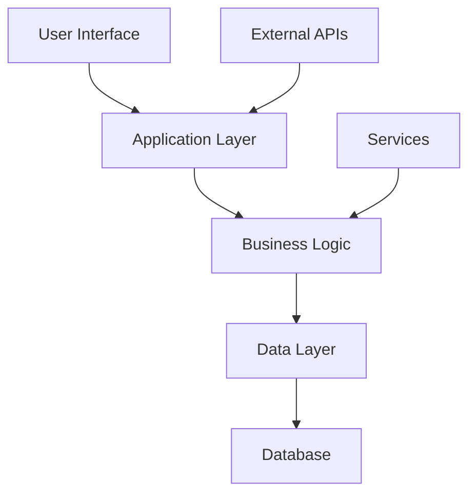
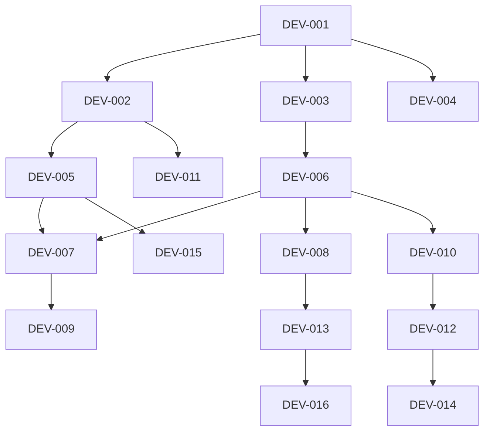
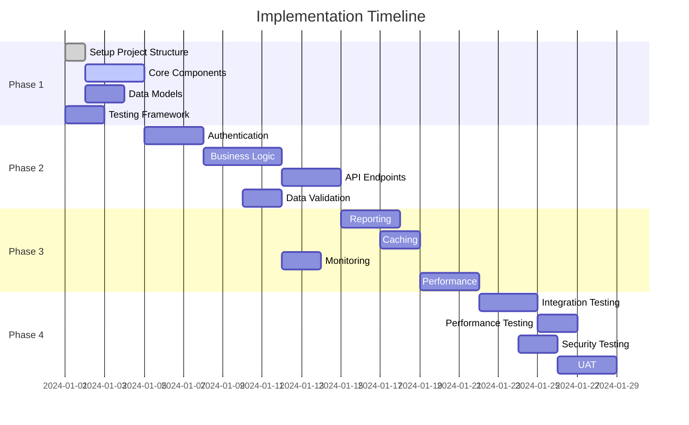

# Implementation Plan: {{implementation_title}}

**Status:** In Progress  
**Scope:** {{scope}}  
**Priority:** {{priority}}  
**Created:** {{current_date}}  
**ICW Cycle:** {{cycle_id}}  
**Specification Reference:** [{{implementation_title}} Specification]({{specification_link}})  
**Test Design Reference:** [{{implementation_title}} Test Design]({{test_design_link}})

---

## Executive Summary

### Implementation Overview
{{implementation_title}} will be implemented through a structured approach following the specifications and test designs defined in the previous phases.

### Key Success Factors
- Adherence to defined specifications
- Comprehensive testing throughout development
- Stakeholder engagement and feedback
- Risk management and mitigation

---

## Architecture and Design

### System Architecture
<!-- High-level architecture overview -->

### Component Design
<!-- Key components and their responsibilities -->

#### Component 1: {{component_name}}
- **Purpose:** 
- **Responsibilities:**
  - 
  - 
  - 
- **Interfaces:**
  - Input: 
  - Output: 
- **Dependencies:**

#### Component 2: {{component_name}}
- **Purpose:** 
- **Responsibilities:**
  - 
  - 
  - 
- **Interfaces:**
  - Input: 
  - Output: 
- **Dependencies:**

### Data Model
<!-- Key data structures and relationships -->

| Entity | Attributes | Relationships |
|--------|------------|--------------|
| | | |
| | | |

### Technology Stack
<!-- Technologies to be used -->

| Layer | Technology | Version | Rationale |
|-------|------------|---------|-----------|
| Frontend | | | |
| Backend | | | |
| Database | | | |
| Testing | | | |
| Deployment | | | |

---

## Development Tasks

### Phase 1: Foundation (Week 1)
<!-- Core infrastructure and basic functionality -->

| Task ID | Task Description | Priority | Estimated Hours | Dependencies | Assignee |
|--------|-----------------|----------|-----------------|--------------|----------|
| DEV-001 | Setup project structure | High | 8 | | |
| DEV-002 | Implement core components | High | 24 | DEV-001 | |
| DEV-003 | Create basic data models | High | 16 | DEV-001 | |
| DEV-004 | Setup testing framework | High | 12 | DEV-001 | |

### Phase 2: Core Features (Week 2-3)
<!-- Main functionality implementation -->

| Task ID | Task Description | Priority | Estimated Hours | Dependencies | Assignee |
|--------|-----------------|----------|-----------------|--------------|----------|
| DEV-005 | Implement user authentication | High | 20 | DEV-002 | |
| DEV-006 | Develop main business logic | High | 32 | DEV-003 | |
| DEV-007 | Create API endpoints | High | 24 | DEV-005, DEV-006 | |
| DEV-008 | Implement data validation | Medium | 16 | DEV-006 | |

### Phase 3: Advanced Features (Week 4-5)
<!-- Advanced and supporting features -->

| Task ID | Task Description | Priority | Estimated Hours | Dependencies | Assignee |
|--------|-----------------|----------|-----------------|--------------|----------|
| DEV-009 | Add reporting features | Medium | 20 | DEV-007 | |
| DEV-010 | Implement caching | Medium | 12 | DEV-006 | |
| DEV-011 | Add monitoring and logging | Medium | 16 | DEV-002 | |
| DEV-012 | Performance optimization | Low | 24 | DEV-010 | |

### Phase 4: Integration and Testing (Week 6)
<!-- System integration and comprehensive testing -->

| Task ID | Task Description | Priority | Estimated Hours | Dependencies | Assignee |
|--------|-----------------|----------|-----------------|--------------|----------|
| DEV-013 | System integration testing | High | 24 | DEV-008 | |
| DEV-014 | Performance testing | High | 16 | DEV-012 | |
| DEV-015 | Security testing | High | 12 | DEV-005 | |
| DEV-016 | User acceptance testing | High | 20 | DEV-013 | |

---

## Task Dependencies

### Dependency Graph
<!-- Visual representation of task dependencies -->

### Critical Path Analysis
<!-- Tasks that determine project duration -->

**Critical Path:** DEV-001 → DEV-002 → DEV-005 → DEV-007 → DEV-009 → DEV-013 → DEV-016
**Critical Path Duration:** 136 hours

---

## Resource Requirements

### Human Resources
<!-- Team composition and roles -->

| Role | Person | Allocation | Responsibilities |
|------|--------|------------|------------------|
| Project Manager | | 50% | Overall coordination |
| Senior Developer | | 100% | Core development |
| Junior Developer | | 100% | Feature development |
| QA Engineer | | 75% | Testing and quality |
| DevOps Engineer | | 25% | Infrastructure |

### Technical Resources
<!-- Tools, environments, and infrastructure -->

| Resource | Specification | Quantity | Purpose |
|----------|----------------|----------|---------|
| Development Environment | | | Individual development |
| Test Environment | | | Integration testing |
| Staging Environment | | | Pre-production testing |
| CI/CD Pipeline | | | Automated builds and deployment |

### External Dependencies
<!-- Third-party services and APIs -->

| Dependency | Provider | Criticality | Contingency Plan |
|------------|----------|------------|-----------------|
| | | | |
| | | | |

---

## Timeline and Milestones

### Project Timeline
<!-- Overall project schedule -->

### Key Milestones
<!-- Major project checkpoints -->

| Milestone | Date | Deliverables | Success Criteria |
|-----------|------|--------------|------------------|
| M1: Foundation Complete | Week 1 | Project setup, core components | All Phase 1 tasks complete |
| M2: Core Features Complete | Week 3 | Main functionality | All Phase 2 tasks complete |
| M3: Feature Complete | Week 5 | All features implemented | All Phase 3 tasks complete |
| M4: Ready for Testing | Week 6 | System integrated | All development tasks complete |
| M5: Production Ready | Week 7 | Tested and validated | All tests passed |

---

## Risk Management

### Risk Assessment Matrix
<!-- Identified risks and their impact -->

| Risk | Probability | Impact | Risk Level | Mitigation Strategy |
|------|-------------|--------|------------|-------------------|
| Technical complexity | Medium | High | High | Proof of concept, incremental development |
| Resource availability | Low | High | Medium | Cross-training, flexible scheduling |
| Requirement changes | High | Medium | High | Change control process, flexible architecture |
| Third-party delays | Medium | Medium | Medium | Alternative vendors, contingency planning |
| Performance issues | Low | High | Medium | Early performance testing, optimization |

### Risk Monitoring
<!-- How risks will be tracked and managed -->

- **Weekly Risk Reviews:** Assess current risk status
- **Risk Register:** Maintain detailed risk information
- **Mitigation Tracking:** Monitor effectiveness of mitigation strategies
- **Escalation Process:** Clear escalation path for high-impact risks

---

## Quality Assurance

### Code Quality Standards
<!-- Standards for code quality -->

| Standard | Target | Measurement Tool |
|----------|--------|------------------|
| Code Coverage | ≥ 85% | SonarQube, coverage.py |
| Code Complexity | < 10 | SonarQube, complexity analysis |
| Code Duplication | < 3% | SonarQube |
| Technical Debt | < 1 day | SonarQube |

### Review Process
<!-- Code review and quality checks -->

1. **Peer Review:** All code requires peer review
2. **Automated Checks:** CI/CD pipeline quality gates
3. **Architecture Review:** Design reviews for major changes
4. **Security Review:** Security assessment for sensitive features

---

## Deployment Strategy

### Deployment Plan
<!-- How the system will be deployed -->

| Environment | Deployment Method | Frequency | Approval Required |
|-------------|-------------------|-----------|------------------|
| Development | Automated CI | On commit | None |
| Test | Automated CI | Daily | QA Lead |
| Staging | Manual | Weekly | Product Owner |
| Production | Manual | On release | All stakeholders |

### Rollback Strategy
<!-- How to handle deployment failures -->

- **Database Rollback:** Versioned database migrations
- **Code Rollback:** Previous version container/image
- **Configuration Rollback:** Versioned configuration files
- **Data Recovery:** Regular backups and point-in-time recovery

---

## Monitoring and Maintenance

### Monitoring Requirements
<!-- What needs to be monitored in production -->

| Metric | Target | Alert Threshold |
|--------|--------|-----------------|
| Response Time | < 2 seconds | > 3 seconds |
| Error Rate | < 1% | > 5% |
| CPU Usage | < 70% | > 85% |
| Memory Usage | < 80% | > 90% |
| Disk Space | < 80% | > 90% |

### Maintenance Plan
<!-- Ongoing maintenance activities -->

- **Daily:** System health checks, backup verification
- **Weekly:** Performance analysis, security scans
- **Monthly:** Patch updates, capacity planning
- **Quarterly:** Architecture review, technology assessment

---

## Communication Plan

### Stakeholder Communication
<!-- How and when stakeholders will be informed -->

| Audience | Frequency | Method | Content |
|----------|-----------|--------|---------|
| Project Team | Daily | Stand-up | Progress, blockers |
| Management | Weekly | Email report | Status, risks, budget |
| Users | Bi-weekly | Demo | Features, feedback |
| Technical Team | As needed | Technical meetings | Architecture, decisions |

### Reporting
<!-- Regular project reports -->

- **Daily Status:** Progress update, blockers
- **Weekly Report:** Comprehensive status, metrics, risks
- **Monthly Review:** Executive summary, budget variance
- **Final Report:** Project outcomes, lessons learned

---

## Success Metrics

### Key Performance Indicators
<!-- How success will be measured -->

| KPI | Target | Measurement Method |
|-----|--------|-------------------|
| On-time Delivery | 100% | Schedule variance |
| Budget Adherence | ±10% | Budget variance |
| Quality | < 5 defects/KLOC | Defect density |
| Performance | Meets requirements | Performance tests |
| User Satisfaction | ≥ 4.5/5 | User surveys |

---

## Quality Gates

### Before Implementation
<!-- Must be completed before starting development -->

- [ ] All requirements approved by stakeholders
- [ ] Technical design reviewed and approved
- [ ] Test plan complete and approved
- [ ] Resource allocation confirmed
- [ ] Risk mitigation strategies defined

### During Implementation
<!-- Ongoing quality checks -->

- [ ] Code reviews completed for all changes
- [ ] Unit tests passing (>85% coverage)
- [ ] Integration tests passing
- [ ] Performance benchmarks met
- [ ] Security scans passed

---

## Conclusion

### Implementation Readiness
This implementation plan provides a comprehensive approach to delivering {{implementation_title}} with high quality, on schedule, and within budget.

### Next Steps
1. Finalize resource allocation
2. Set up development environments
3. Begin Phase 1 implementation
4. Establish monitoring and reporting

---

**Last Updated:** {{current_date}}  
**Implementation Start:** {{start_date}}  
**Target Completion:** {{completion_date}}  
**ICW Progress:** Phase 3 of 3 Complete
